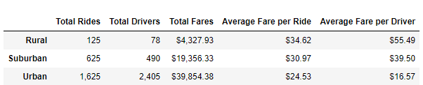

# PyBer_Analysis
# Analysis of PyBer Ridesharing Data
> Python script written & managed in Jupyter Notebook using PANDAS and Matplotlib libraries used to read, analyze, and output charts and graphs of rideshare data.

## Overview of PyBer Analysis
> Analysis conducted to create visualization of differences in rideshare fares for urban, rural, and suburban city types. 

### Results
> PyBer Data Summary

    - The urban city type has more than double the total number of rides as the suburban type and 13 times as many as rural areas. 

    - Urban cities also have nearly five times as many drivers as suburban cities and 30 times that of rural ones. 

    - Although the urban cities have the lowest average fare per ride ($24.53) and the lowest average fare per driver ($16.57), it has more than double the total fares of suburban cities and more than 9 times as much as the rural cities. 

    - A noteworthy observation is the total number of drivers in urban city types far surpasses the total number of rides which is the only city type to have more drivers than rides. 

    - Using data from the first four months of 2019 there is a clear distinction in the fare totals by city type with urban consistently bringing in the highest totals, rural the lowest, and suburban in between the two with no overlap of any of the lines. 

## Summary
> Thorough analysis of the data indicates a clear disparity in the revenue totals across the different city types. While a cursory glance at the summarized data shows higher fares per ride and per driver in rural areas and the lowest average fares in urban areas, this proves to be inversely related to the total revenue from that area. Recommendations for the business based on this analysis are as follows:

        - Decrease the total number of drivers in urban areas. There seems to be a much higher supply of drivers than the demand calls for. 

        - Expansion of the business to new areas should focus primarily on urban areas and secondarily on suburban ones. Rural areas generate very little revenue. 

        - Conduct additional data collection and analysis of urban areas specifically. Data metrics around time of day and length of trip could lead to further insights.  